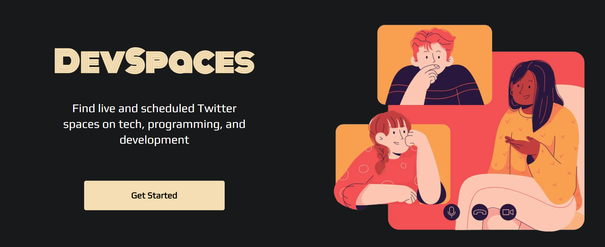
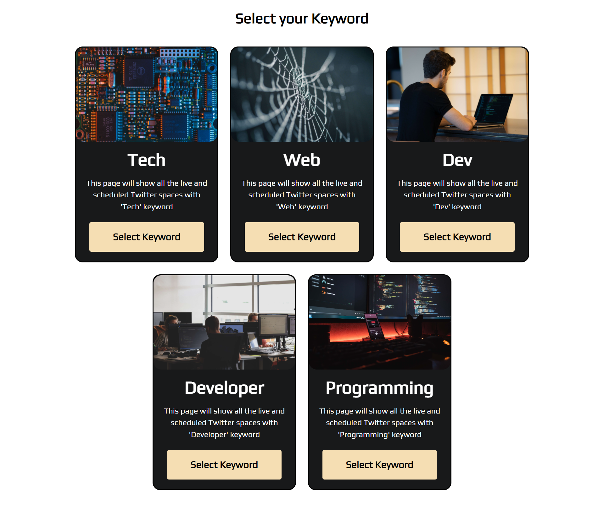
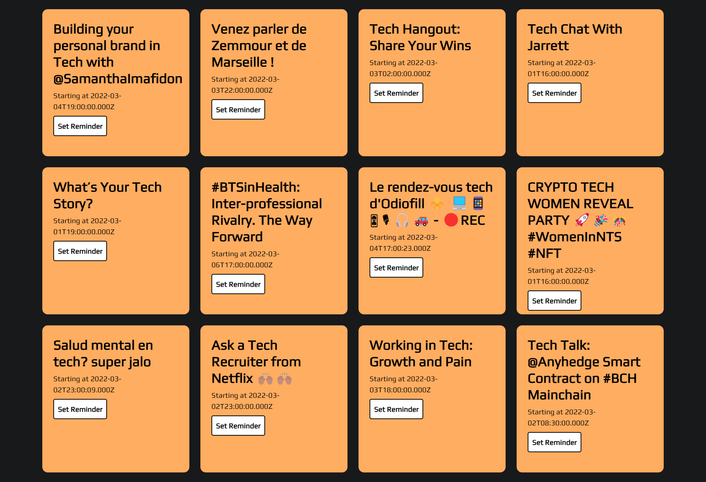
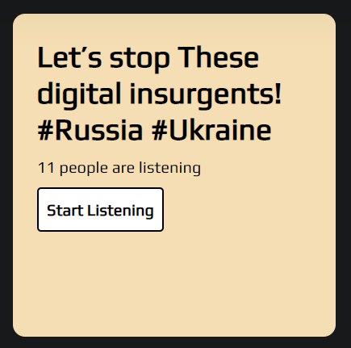
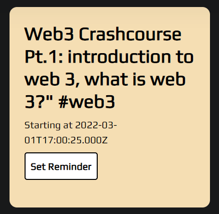

# Introducing DevSpaces

DevSpaces is an open-source twitter spaces finder app for programmers. It uses keywords like 'tech', 'programming', 'web' etc. to fetch spaces related to those keywords from Twitter API and display it on the UI.

## Tech Stack

* NextJS - for building
* TailwindCSS - for styling
* SuperTokens - for user auth
* Netlify - for deployment

## How it works

1. **DevSpaces** ask you to select one of the existing keyword card. Currently there are 5 keyword cards - *Tech, Web, Dev, Developer, and Programming.*

2. Once you select the keyword, the sign in page will be open. Enter your login credentials or else sign up if are visiting for the first time.

3. Once signed in, you can see all the current live and scheduled spaces related to that keyword and enjoy your favorite ones.

For the first version, there are 5 keyword cards-

1. **Tech**
2. **Web**
3. **Dev**
4. **Developer**
5. **Programming**

You can select any one of it and see the current live and scheduled spaces of that keyword if you are signed in.

If the space is live you will be shown the **Start Listening** button in Space card along with the number of current listeners.

If the space is scheduled, you will be shown the **Set Reminder** button in Space card along with the scheduled time in *ISO 8601* format.

Both **Start Listening** and **Set Reminder** button will lead you to the twitter link of that particular space.

## Contribution Guidelines

DevSpaces is an open source project and all the open source enthusiasts are encouraged to contribute to the project if they wish to.

To get started-

* Fork the repository
* Clone it locally
* Create a new branch for your changes
* Make your changes
* Push your changes
* Create a pull request
* Wait for the maintainers to accept or reject your changes.

